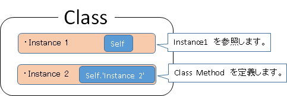

# worksample
DIVE INTO CODE worksample  
 

`self`には2つの利用方法があります。  

## インスタンスオブジェクト内で利用される場合
インスタンスオブジェクト自身を参照します。

## メソッド定義で`Self.メソッド名`を利用する場合
クラスメソッドを定義します。　　
  
例  
	
	class Dive
	  attr_accessor :name

	  def instance1(name)
	#instance1 を参照します。
		self　　
	  end
	  #クラスメソッド
	  def self.code
	    #この場合のselfの扱いは、Diveクラス
	    puts "#{self}クラス"
	  end
	end

	#Diveのオブジェクトを生成。引数を与えます
	test = Dive.new("Dive太郎")

	#クラスメソッドの呼び出し
	Dive.code